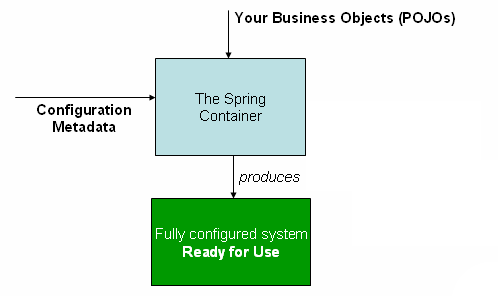

`org.springframework.context.ApplicationContext` là interface đại diện cho Spring IoC container. Nó chịu trách nhiệm tạo ra, cấu hình và lắp ráp các beans trong ứng dụng của bạn.

Một số triển khai của interface ApplicationContext bao gồm: `ClassPathXmlApplicationContext`, `FileSystemXmlApplicationContext`, và `AnnotationConfigApplicationContext`.



## Dependency Injection

DI là một mẫu thiết kế mà các phụ thuộc (dependencies) của một đối tượng được cung cấp (injected) từ bên ngoài thay vì đối tượng tự tạo hoặc tìm kiếm chúng.

Trong Spring, DI được thực hiện thông qua việc cấu hình các beans trong IoC container. Khi một bean được yêu cầu, container sẽ tạo ra bean đó và tự động cung cấp các phụ thuộc cần thiết dựa trên cấu hình đã định nghĩa.

DI có thể được thực hiện thông qua constructor injection, setter injection, hoặc field injection.

### Constructor-based Dependency Injection

Constructor-based DI sử dụng constructor của lớp để cung cấp các phụ thuộc cần thiết. Khi một bean được tạo ra, container sẽ gọi constructor với các tham số tương ứng với các phụ thuộc đã định nghĩa.

```java ConstructorInjection.java example icon=java lines
public class SimpleMovieLister {

    // the SimpleMovieLister has a dependency on a MovieFinder
    private final MovieFinder movieFinder;

    // a constructor so that the Spring container can inject a MovieFinder
    public SimpleMovieLister(MovieFinder movieFinder) {
        this.movieFinder = movieFinder;
    }

    // business logic that actually uses the injected MovieFinder is omitted...
}
```

### Setter-based Dependency Injection

Setter-based DI sử dụng các phương thức setter để cung cấp các phụ thuộc cần thiết. Khi một bean được tạo ra, container sẽ gọi các phương thức setter với các giá trị tương ứng với các phụ thuộc đã định nghĩa.

```java SetterInjection.java example icon=java lines
public class SimpleMovieLister {

    // the SimpleMovieLister has a dependency on a MovieFinder
    private MovieFinder movieFinder;

    // a setter so that the Spring container can inject a MovieFinder
    public void setMovieFinder(MovieFinder movieFinder) {
        this.movieFinder = movieFinder;
    }

    // business logic that actually uses the injected MovieFinder is omitted...
}
```

<Accordion title="Constructor-based or setter-based DI?">
  Constructor-based DI được ưu tiên hơn vì nó đảm bảo rằng các dependencies cần thiết được cung cấp ngay khi đối tượng được tạo ra, giúp tránh các lỗi liên quan đến việc sử dụng đối tượng chưa được khởi tạo đầy đủ. Ngoài ra, constructor-based DI cho phép tạo ra các `immutable` objects và đảm bảo các dependencies không `null`.

  Setter-based DI có thể hữu ích trong các trường hợp mà một số dependencies là tùy chọn hoặc khi cần thay đổi dependencies sau khi đối tượng đã được tạo ra.
</Accordion>

<Accordion title="Circular Dependency (phụ thuộc vòng)?">
  **Vấn đề**: Khi hai `@Bean` phụ thuộc lẫn nhau theo kiểu vòng tròn (Bean A cần Bean B, và Bean B lại cần Bean A).

  1. Spring xử lý Circular Dependency như thế nào? Mặc định, Spring xử lý được phụ thuộc vòng cho các Singleton Bean được tiêm thông qua Setter hoặc Field Injection nhờ vào bộ nhớ đệm 3 tầng (Three-level Cache).

  Tuy nhiên, nếu bạn sử dụng Constructor Injection, Spring sẽ báo lỗi `BeanCurrentlyInCreationException` vì nó không thể tạo ra instance nào trước để đưa vào bộ nhớ đệm.

  **Xử lý**:

  - Sử dụng @Lazy: Spring sẽ tiêm một Proxy thay vì Bean thật ngay lập tức

  ```java icon=java lines
  @Bean
  public ServiceA serviceA(@Lazy ServiceB serviceB) {
    return new ServiceAImpl(serviceB);
  }
  
  @Bean
  public ServiceB serviceB(ServiceA serviceA) {
    return new ServiceBImpl(serviceA);
  }
  ```
  - Tránh Constructor Injection trong `@Configuration`: Trong các phương thức `@Bean`, việc truyền tham số vào phương thức chính là một dạng Constructor Injection. Nếu xảy ra vòng lặp, hãy cân nhắc chuyển sang Setter Injection bên trong lớp thực thi:
```java icon=java lines
@Component
public class ServiceAImpl implements ServiceA {
    private ServiceB serviceB;

    @Autowired
    public void setServiceB(ServiceB serviceB) { // Setter Injection xử lý vòng lặp tốt hơn
        this.serviceB = serviceB;
    }
}
```
</Accordion>